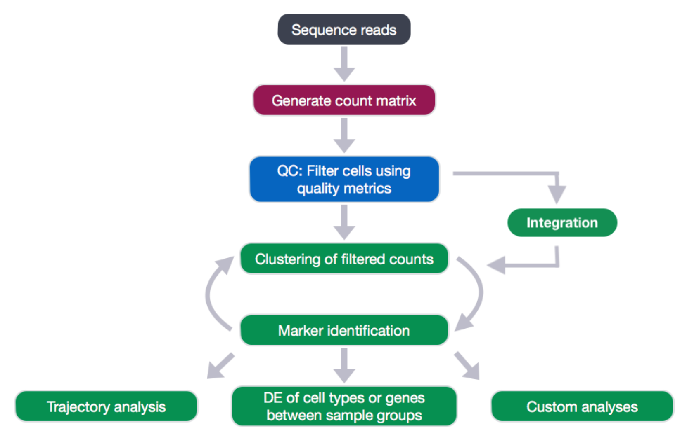
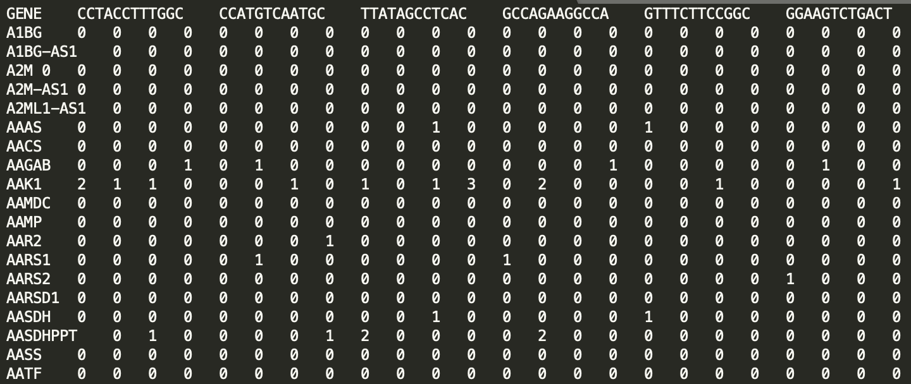
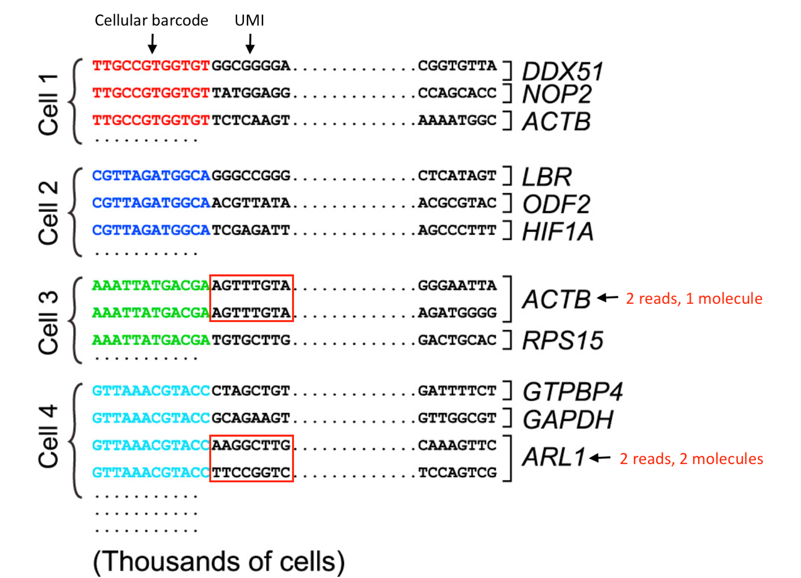
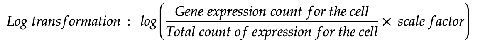

------------------------------------------------------------------------

------------------------------------------------------------------------

# Review of the study "Integrative single-cell analysis of transcriptional and epigenetic states in the human adult brain" by Lake, B., Chen, S., Sos, B. *et al.*

# Computational Analysis



Fig Source: <https://hbctraining.github.io/scRNA-seq/lessons/04_SC_quality_control.html>

## Expression Matrix

The expression matrix obtained from the quantification step has the following structure:



It is analogous to a Count matrix type of word embedding in text analytics:

{width="533"}

Fig 2

[**Terminology:**]{.ul}

**UMIs:** Unique Molecular Identifiers -\> Used to uniquely identify a true biological read. Technical duplicates created due to PCR amplification will be collapsed into a single read during the creation of the expression matrix.



***Image credit:** modified from Macosko EZ et al. Highly Parallel Genome-wide Expression Profiling of Individual Cells Using Nanoliter Droplets, Cell 2015 ([https://doi.org/10.1016/j.cell.2015.05.002)](https://doi.org/10.1016/j.cell.2015.05.002))*

## Initializing libraries

There are many libraries available for Single cell analysis and Quality control:

**Bioconductor Project** - Open-Source libraries mostly in R, to perform statistical analysis on Genomic data

SingleCellExperiment - Bioconductor library which offers specialized methods to store and retrieve spike-in information, dimensionality reduction coordinates and size factors for each cell, along with the usual metadata for genes and libraries.

AnnotationHub - This package provides a client for the Bioconductor AnnotationHub web resource. Can retrieve genomic files, metadata from ensembl, UCSC etc.

ensembldb - Bioconductor package which provides functions to create and use transcript centric annotation databases/packages

**Seurat** - Seurat is an R package designed for QC, analysis, and exploration of single-cell RNA-seq data

**Matrix** - A rich hierarchy of matrix classes, including triangular, symmetric, and diagonal matrices, both dense and sparse and with pattern, logical and numeric entries. Numerous methods for and operations on these matrices

```{r}
library(tidyverse)
#library(SingleCellExperiment)
library(Matrix)
#ibrary(AnnotationHub)
#library(ensembldb)
library(ggplot2)
library(scales)
library(Seurat)
```

## Creating Seurat Objects of all the samples

The `Seurat` object -\> Complex data structure

At the top level, the `Seurat` object serves as a collection of `Assay` and `DimReduc` objects.

The `Assay` objects are designed to hold expression data of a single type, such as RNA-seq gene expression, CITE-seq ADTs, cell hashtags, or imputed gene values. 

`DimReduc`objects represent transformations of the data contained within the `Assay` object(s) via various dimensional reduction techniques such as PCA.

| `assays`       | A list of assays within this object                                             |
|----------------|---------------------------------------------------------------------------------|
| `meta.data`    | Cell-level meta data                                                            |
| `active.assay` | Name of active, or default, assay                                               |
| `active.ident` | Identity classes for the current object                                         |
| `graphs`       | A list of nearest neighbor graphs                                               |
| `reductions`   | A list of DimReduc objects                                                      |
| `project.name` | User-defined project name (optional)                                            |
| `tools`        | Empty list. Tool developers can store any internal data from their methods here |
| `misc`         | Empty slot. User can store additional information here                          |
| `version`      | Seurat version used when creating the object                                    |

```{r}

counts <- read.table(file = "countmatrices/out_SRR5904942_gene_exon_tagged.dge.txt", header = TRUE, row.names = 1, colClasses =c("character", rep("numeric", 2500)))
s42<- CreateSeuratObject(counts=counts, project = "Cerebellar_Hemisphere")
rm(counts)

```

```{r}
s42@assays

```

```{r}
 s42[['RNA']]

```

```{r}
s42@meta.data

```

```{r}
s42@graphs

```

**Assays** contain the following variables

+-----------------+------------------------------------------------------------------------------+
| **\             | **Function**                                                                 |
| Slot**          |                                                                              |
+=================+==============================================================================+
| `counts`        | Stores unnormalized data such as raw counts or TPMs                          |
+-----------------+------------------------------------------------------------------------------+
| `data`          | Normalized data matrix                                                       |
+-----------------+------------------------------------------------------------------------------+
| `scale.data`    | Scaled data matrix                                                           |
+-----------------+------------------------------------------------------------------------------+
| `key`           | A character string to facilitate looking up features from a specific `Assay` |
+-----------------+------------------------------------------------------------------------------+
| `var.features`  | A vector of features identified as variable                                  |
+-----------------+------------------------------------------------------------------------------+
| `meta.features` | Feature-level meta data                                                      |
+-----------------+------------------------------------------------------------------------------+

```{r}
s42[1:3, 1:3][['RNA']]@counts

```

```{r}

s42[1:3, 1:3][['RNA']]@data
```

```{r}

s42 <- AddMetaData(
  object = s42,
  metadata = 'a',
  col.name = 'letter.idents'
)

```

```{r}
s42@meta.data

```

```{r}

counts <- read.table(file = "countmatrices/out_SRR5904942_gene_exon_tagged.dge.txt", header = TRUE, row.names = 1, colClasses =c("character", rep("numeric", 2500)))
s42<- CreateSeuratObject(counts=counts, project = "Cerebellar_Hemisphere")
rm(counts)

counts <- read.table(file = "countmatrices/out_SRR5904943_gene_exon_tagged.dge.txt", header = TRUE, row.names = 1, colClasses =c("character", rep("numeric", 2500)))
s43<- CreateSeuratObject(counts=counts, project = "Cerebellar_Hemisphere")
rm(counts)

counts <- read.table(file = "countmatrices/out_SRR5904944_gene_exon_tagged.dge.txt", header = TRUE, row.names = 1, colClasses =c("character", rep("numeric", 2500)))
s44<- CreateSeuratObject(counts=counts, project = "Cerebellar_Hemisphere")
rm(counts)

counts <- read.table(file = "countmatrices/out_SRR5904945_gene_exon_tagged.dge.txt", header = TRUE, row.names = 1, colClasses =c("character", rep("numeric", 2500)))
s45<- CreateSeuratObject(counts=counts, project = "Cerebellar_Hemisphere")
rm(counts)

counts <- read.table(file = "countmatrices/out_SRR5904946_gene_exon_tagged.dge.txt", header = TRUE, row.names = 1, colClasses =c("character", rep("numeric", 2500)))
s46<- CreateSeuratObject(counts=counts, project = "Cerebellar_Hemisphere")
rm(counts)

counts <- read.table(file = "countmatrices/out_SRR5904947_gene_exon_tagged.dge.txt", header = TRUE, row.names = 1, colClasses =c("character", rep("numeric", 2500)))
s47<- CreateSeuratObject(counts=counts, project = "Cerebellar_Hemisphere")
rm(counts)

counts <- read.table(file = "countmatrices/out_SRR5904948_gene_exon_tagged.dge.txt", header = TRUE, row.names = 1, colClasses =c("character", rep("numeric", 2500)))
s48<- CreateSeuratObject(counts=counts, project = "Cerebellar_Hemisphere")
rm(counts)

counts <- read.table(file = "countmatrices/out_SRR5904949_gene_exon_tagged.dge.txt", header = TRUE, row.names = 1, colClasses =c("character", rep("numeric", 2500)))
s49<- CreateSeuratObject(counts=counts, project = "Cerebellar_Hemisphere")
rm(counts)

counts <- read.table(file = "countmatrices/out_SRR5904950_gene_exon_tagged.dge.txt", header = TRUE, row.names = 1, colClasses =c("character", rep("numeric", 2500)))
s50<- CreateSeuratObject(counts=counts, project = "Visual_Cortex")
rm(counts)

counts <- read.table(file = "countmatrices/out_SRR5904951_gene_exon_tagged.dge.txt", header = TRUE, row.names = 1, colClasses =c("character", rep("numeric", 2500)))
s51<- CreateSeuratObject(counts=counts, project = "Visual_Cortex")
rm(counts)

counts <- read.table(file = "countmatrices/out_SRR5904952_gene_exon_tagged.dge.txt", header = TRUE, row.names = 1, colClasses =c("character", rep("numeric", 2500)))
s52<- CreateSeuratObject(counts=counts, project = "Visual_Cortex")
rm(counts)

counts <- read.table(file = "countmatrices/out_SRR5904953_gene_exon_tagged.dge.txt", header = TRUE, row.names = 1, colClasses =c("character", rep("numeric", 2500)))
s53<- CreateSeuratObject(counts=counts, project = "Visual_Cortex")
rm(counts)

counts <- read.table(file = "countmatrices/out_SRR5904954_gene_exon_tagged.dge.txt", header = TRUE, row.names = 1, colClasses =c("character", rep("numeric", 2500)))
s54<- CreateSeuratObject(counts=counts, project = "Visual_Cortex")
rm(counts)

counts <- read.table(file = "countmatrices/out_SRR5904955_gene_exon_tagged.dge.txt", header = TRUE, row.names = 1, colClasses =c("character", rep("numeric", 2500)))
s55<- CreateSeuratObject(counts=counts, project = "Visual_Cortex")
rm(counts)

counts <- read.table(file = "countmatrices/out_SRR5904956_gene_exon_tagged.dge.txt", header = TRUE, row.names = 1, colClasses =c("character", rep("numeric", 2500)))
s56<- CreateSeuratObject(counts=counts, project = "Cerebellar_Hemisphere")
rm(counts)

counts <- read.table(file = "countmatrices/out_SRR5904957_gene_exon_tagged.dge.txt", header = TRUE, row.names = 1, colClasses =c("character", rep("numeric", 2500)))
s57<- CreateSeuratObject(counts=counts, project = "Cerebellar_Hemisphere")
rm(counts)

counts <- read.table(file = "countmatrices/out_SRR5904958_gene_exon_tagged.dge.txt", header = TRUE, row.names = 1, colClasses =c("character", rep("numeric", 2500)))
s58<- CreateSeuratObject(counts=counts, project = "Cerebellar_Hemisphere")
rm(counts)

counts <- read.table(file = "countmatrices/out_SRR5904959_gene_exon_tagged.dge.txt", header = TRUE, row.names = 1, colClasses =c("character", rep("numeric", 2500)))
s59<- CreateSeuratObject(counts=counts, project = "Cerebellar_Hemisphere")
rm(counts)

counts <- read.table(file = "countmatrices/out_SRR5904960_gene_exon_tagged.dge.txt", header = TRUE, row.names = 1, colClasses =c("character", rep("numeric", 2500)))
s60<- CreateSeuratObject(counts=counts, project = "Cerebellar_Hemisphere")
rm(counts)

counts <- read.table(file = "countmatrices/out_SRR5904961_gene_exon_tagged.dge.txt", header = TRUE, row.names = 1, colClasses =c("character", rep("numeric", 2500)))
s61<- CreateSeuratObject(counts=counts, project = "Cerebellar_Hemisphere")
rm(counts)

counts <- read.table(file = "countmatrices/out_SRR5904962_gene_exon_tagged.dge.txt", header = TRUE, row.names = 1, colClasses =c("character", rep("numeric", 2500)))
s62<- CreateSeuratObject(counts=counts, project = "Frontal_Cortex")
rm(counts)

counts <- read.table(file = "countmatrices/out_SRR5904963_gene_exon_tagged.dge.txt", header = TRUE, row.names = 1, colClasses =c("character", rep("numeric", 2500)))
s63<- CreateSeuratObject(counts=counts, project = "Frontal_Cortex")
rm(counts)

counts <- read.table(file = "countmatrices/out_SRR5904964_gene_exon_tagged.dge.txt", header = TRUE, row.names = 1, colClasses =c("character", rep("numeric", 2500)))
s64<- CreateSeuratObject(counts=counts, project = "Frontal_Cortex")
rm(counts)

counts <- read.table(file = "countmatrices/out_SRR5904965_gene_exon_tagged.dge.txt", header = TRUE, row.names = 1, colClasses =c("character", rep("numeric", 2500)))
s65<- CreateSeuratObject(counts=counts, project = "Frontal_Cortex")
rm(counts)

counts <- read.table(file = "countmatrices/out_SRR5904966_gene_exon_tagged.dge.txt", header = TRUE, row.names = 1, colClasses =c("character", rep("numeric", 2500)))
s66<- CreateSeuratObject(counts=counts, project = "Cerebellar_Hemisphere")
rm(counts)

counts <- read.table(file = "countmatrices/out_SRR5904967_gene_exon_tagged.dge.txt", header = TRUE, row.names = 1, colClasses =c("character", rep("numeric", 2500)))
s67<- CreateSeuratObject(counts=counts, project = "Cerebellar_Hemisphere")
rm(counts)

counts <- read.table(file = "countmatrices/out_SRR5904968_gene_exon_tagged.dge.txt", header = TRUE, row.names = 1, colClasses =c("character", rep("numeric", 2500)))
s68<- CreateSeuratObject(counts=counts, project = "Cerebellar_Hemisphere")
rm(counts)

counts <- read.table(file = "countmatrices/out_SRR5904969_gene_exon_tagged.dge.txt", header = TRUE, row.names = 1, colClasses =c("character", rep("numeric", 2500)))
s69<- CreateSeuratObject(counts=counts, project = "Cerebellar_Hemisphere")
rm(counts)
```

## Merging all the samples into a single Seurat Object

```{r}
so.merged <- merge(s42, y = c(s43, s44, s45, s46, s47, s48, s49, s50, s51, s52, s53, s54, s55, s56, s57, s58, s59, s60, s61, s62, s63, s64, s65, s66, s67, s68, s69), 
add.cell.ids = c("s42","s43","s44","s45","s46","s47","s48","s49","s50","s51","s52","s53","s54","s55","s56","s57","s58","s59","s60","s61","s62","s63","s64","s65","s66","s67","s68","s69"))

```

```{r}

so.merged

```

```{r}

so.merged@meta.data

```

## Free individual objects memory

```{r}
rm(s42,s43,s44,s45,s46,s47,s48,s49,s50,s51,s52,s53,s54,s55,s56,s57,s58,s59,s60,s61,s62,s63,s64,s65,s66,s67,s68,s69)
```

# Quality Control

Goals:

-   To filter the data to only include true cells that are of high quality, so that when we cluster our cells it is easier to identify distinct cell type populations

-   To identify any failed samples and either try to salvage the data or remove from analysis, in addition to, trying to understand why the sample failed

Challenges:

-   Delineating cells that are poor quality from less complex cells

-   Choosing appropriate thresholds for filtering, so as to keep high quality cells without removing biologically relevant cell types

```{r}

df<-as.data.frame(so.merged@meta.data[['orig.ident']])
df

```

## Histogram of cell counts grouped by tissue

```{r}
ggplot(df, aes(x=so.merged@meta.data[["orig.ident"]])) + ggtitle("Plot of counts of cells per tissue in the merged seurat object") +
  xlab("Tissue type") + ylab("Cell count") + geom_histogram(stat="count")

```

```{r}
mito.genes <- grep(pattern = "^MT-", x = rownames(so.merged@assays[["RNA"]]), value = TRUE)

percent.mito <- Matrix::colSums(so.merged@assays[["RNA"]][mito.genes, ])/Matrix::colSums(so.merged@assays[["RNA"]])

# AddMetaData adds columns to object@meta.data, and is a great place to
# stash QC stats

#Seurat v2 function, but shows compatibility in Seurat v3
so.merged <- AddMetaData(object = so.merged, metadata = percent.mito, col.name = "percent.mito") 
#in case the above function does not work simply do:
so.merged$percent.mito <- percent.mito

```

## Violin Plot

This plot is used to obtain the mean and the distribution of

1.  Number of features (genes) expressed per cell in all the three tissue types
2.  Total counts of genes expressed per cell in all the three tissue types
3.  Percentage of mitochondrial genes in each tissue type

We will remove the cells which have high mitochondrial gene percentage ( These are damaged/ dead cells) from further analysis.

Also, we will omit cells which express unique gene counts (nFeature_RNA) over 1500 or less than 300

-   Low-quality cells or empty droplets will often have very few genes

-   Cell doublets or multiplets may exhibit a high gene count

```{r}

VlnPlot(object = so.merged, features = c("nFeature_RNA", "nCount_RNA", "percent.mito"), ncol = 3)

```

## Feature Scatter plot

Here, we visualize the percentage of mitochondrial genes vs UMI counts grouped by the tissue type

We can see again that Cerebellar hemisphere tissue runs have high mitochondrial percentage for some cells, while Visual cortex cells have high UMI counts for some cells ( possibly doublets )

```{r}

par(mfrow = c(1, 2))
FeatureScatter(object = so.merged, feature1 = "nCount_RNA", feature2 = "percent.mito")

```

The below feature scatter plot visualizes the

```{r}

FeatureScatter(object = so.merged, feature1 = "nCount_RNA", feature2 = "nFeature_RNA")
```

## Filtering out cells

Here, we filter out the cells that have high mitochondrial percentage, or have number of expressed features \< 300 or \> 1500

```{r}

so.merged <- subset(x = so.merged, subset = nFeature_RNA > 300 & nFeature_RNA < 1500 & percent.mito >  -Inf & percent.mito < 0.05 )
```

```{r}

VlnPlot(object = so.merged, features = c("nFeature_RNA", "nCount_RNA", "percent.mito"), ncol = 3)

```

## Normalize the data

While the now widespread use of unique molecular identifiers (UMI) in scRNA-seq removes technical variation associated with PCR, Other technical variation exists:

1.  differences in cell lysis,
2.  reverse transcription efficiency - All transcripts may not be converted to cDNA
3.  stochastic molecular sampling during sequencing
4.  sequencing depth variation between cells

These same challenges apply to bulk RNA-seq workflows, but are exacerbated due to the extreme comparative sparsity of scRNA-seq data.

(Source: <https://genomebiology.biomedcentral.com/articles/10.1186/s13059-019-1874-1> )



this approach mitigated the relationship between sequencing depth and gene expression

Normalized values are stored in so.merged`[["RNA"]]@data`.

```{r}
so.merged <- NormalizeData(object = so.merged, normalization.method = "LogNormalize", scale.factor = 10000)
```

Normalization can be of two types:

1.  Size factor based - Assumes that RNA content is same for all the cells, and hence single scaling factor can be applied to all of them

    Eg: Log normalization

2.  Probabilistic - generalized linear model (GLM) for each gene

    Eg: Regularized negative binomial regression

```{r}
#so.merged <- SCTransform(so.merged, vars.to.regress = "percent.mito", verbose = FALSE)

```

```{r}

so.merged[["RNA"]]@data
```

## Scatter Plot

```{r}
scatterplot <- FeatureScatter(so.merged, feature1 = "nCount_RNA", feature2 = "nFeature_RNA")
scatterplot
```

## Find variable genes

**`FindVariableGenes`** calculates the average expression and dispersion for each gene, places these genes into bins, and then calculates a z-score for dispersion within each bin.

The dispersion vs avg-expression plot can help you decide the cutoff for x.low.cutoff, x.high.cutoff and y.cutoff

    pbmc <- FindVariableGenes(object = pbmc, mean.function = ExpMean, dispersion.function = LogVMR, 
        x.low.cutoff = 0.0125, x.high.cutoff = 3, y.cutoff = 0.5)

```{r}
rm(scatterplot)
so.merged <- FindVariableFeatures(so.merged, selection.method = "vst", nfeatures = 2000)

# Identify the 10 most highly variable genes
top10 <- head(VariableFeatures(so.merged), 10)

# plot variable features with and without labels
plot1 <- VariableFeaturePlot(so.merged)
plot2 <- LabelPoints(plot = plot1, points = top10, repel = TRUE)
plot1
```

## Scale data

To remove biological sources of variation (cell cycle stage).

Seurat constructs linear models to predict gene expression based on user-defined variables.

We can regress out based on:

1.  Cell cycle
2.  cell-cell variation in gene expression driven by batch (if applicable), cell alignment rate (as provided by Drop-seq tools for Drop-seq data), the number of detected molecules, and mitochondrial gene expression.

Seurat v2.0 implements this regression as part of the data scaling process. This is achieved through the vars.to.regress argument in `ScaleData`.

```{r}
all.genes <- rownames(so.merged)
so.merged <- ScaleData(so.merged, vars.to.regress = c("nCounts_RNA", "percent.mito"))
```

```{r}
so.merged
```

## Run PCA

```{r}
so.merged <- RunPCA(object = so.merged, pc.genes = so.merged@var.genes, do.print = TRUE, pcs.print = 1:150, genes.print = 5)
```

## PCA Plot

```{r}
DimPlot(object = so.merged, reduction = "pca")

```

## Variable feature plot

```{r}
VariableFeaturePlot(object = so.merged)

```

## Heatmap

```{r}
DimHeatmap(object = so.merged, reduction = "pca", cells = 2000, balanced = TRUE)
```

## Elbow Plot

```{r}
ElbowPlot(object = so.merged)
```

## Nearest Neighbors

```{r}
so.merged <- FindNeighbors(so.merged, reduction = "pca", dims = 1:15)
```

## Find clusters

```{r}
so.merged <- FindClusters(so.merged, resolution = 0.5, algorithm = 1)
```

## Run TSNE

```{r}
so.merged <- RunTSNE(object = so.merged, dims.use = 1:15, do.fast = TRUE, check_duplicates = FALSE)

```

```{r}
TSNEPlot(object = so.merged)
```

## TSNE by tissue type

```{r}
DimPlot(so.merged, reduction = "tsne", group.by = "orig.ident" )
```

## UMAP 20 PCs

```{r}
# Run UMAP map on first 20 PCs
so.merged <- RunUMAP(object = so.merged, dims = 1:20)
# Plot results
DimPlot(object = so.merged, reduction = 'umap')
```

## UMAP by tissue

```{r}
DimPlot(object = so.merged, reduction = 'umap', group.by = "orig.ident")
```

## Feature Plot

```{r}

FeaturePlot(object = so.merged, features = c("CHN1"), cols = c("grey", "blue"), reduction = "umap", pt.size = 0.1)
```

```{r}

FeaturePlot(object = so.merged, features = c("CREG2"), cols = c("grey", "blue"), reduction = "umap", pt.size = 0.1)


```

```{r}

FeaturePlot(object = so.merged, features = c("TFAP2B"), cols = c("grey", "blue"), reduction = "umap", pt.size = 0.1)

```

```{r}

FeaturePlot(object = so.merged, features = c("GRID2"), cols = c("grey", "blue"), reduction = "umap", pt.size = 0.1)
```

```{r}

FeaturePlot(object = so.merged, features = c("MALAT1"), cols = c("grey", "blue"), reduction = "umap", pt.size = 0.1)

```
